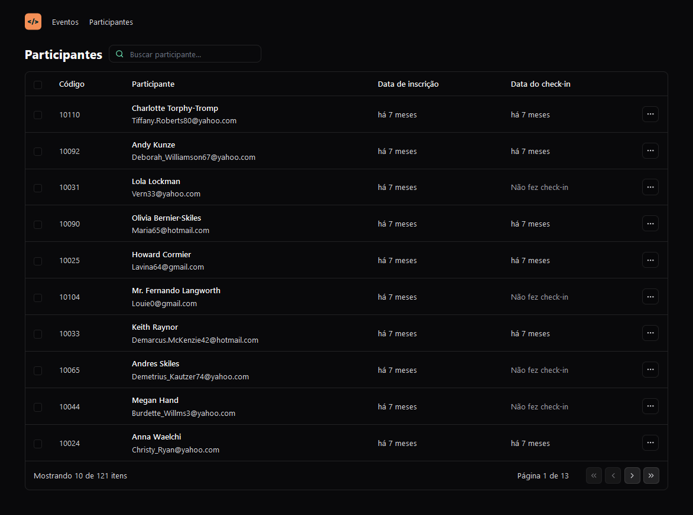

  

Aplicação desenvolvida no NLW Unite da Rocketseat na trilha React.

  <a href="#-tecnologias">Tecnologias</a>&nbsp;&nbsp;&nbsp;|&nbsp;&nbsp;&nbsp;
  <a href="#-projeto">Projeto</a>&nbsp;&nbsp;&nbsp;|&nbsp;&nbsp;&nbsp;
  <a href="#memo-licença">Licença</a>

  

 

  

## 🛠️ Tecnologias

Esse projeto foi desenvolvido com as seguintes tecnologias:

- React
- TypeScript
- Tailwind CSS
- Vite.js

## 🚀 Projeto

Nesse projeto iremos desenvolver um sistema de check-in para eventos presenciais, Se trata de uma tabela com a listagem dos dados e informações de usuários que se cadastraram no evento. a simulação dos dados foi feita utilizado a API feita na tilha de Node.js